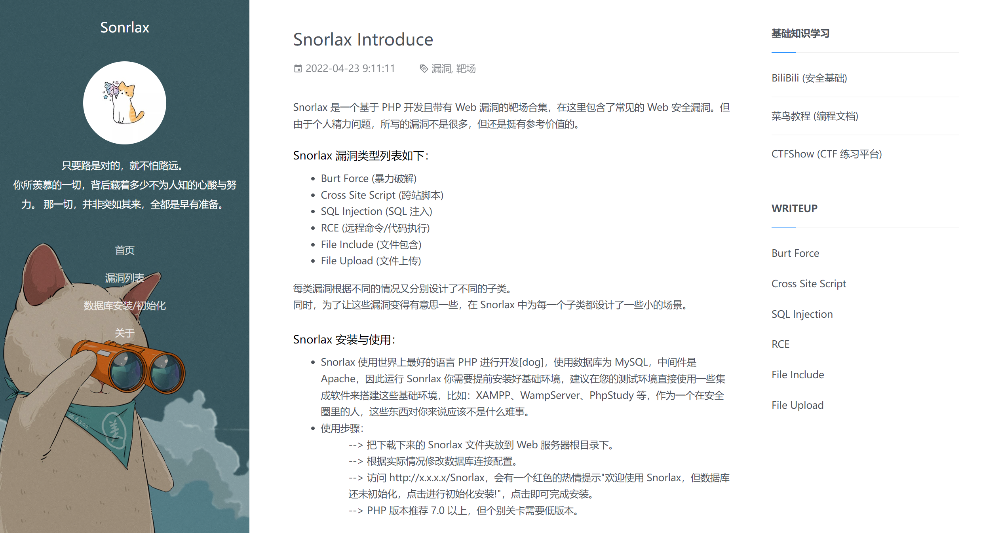

# Snorlax

如果你想搞懂一个漏洞，比较好的方法是："你可以自己先构造出对应漏洞环境（用代码编写），然后再利用它，最后再修复它。" 
  -- zhuifengshaonianhanlu(Pikachu)
 

## Introduce
Snorlax 是一个基于 PHP 开发且带有 Web 漏洞的靶场合集，在这里包含了常见的 Web 安全漏洞。但由于个人精力问题，所写的漏洞不是很多，但还是挺有参考价值的。
  

 
## 漏洞类型列表如下
- Burt Force (暴力破解)
- Cross Site Script (跨站脚本)
- SQL Injection (SQL 注入)
- RCE (远程命令/代码执行)
- File Include (文件包含)
- File Upload (文件上传) 

每类漏洞根据不同的情况又分别设计了不同的子类。同时，为了让这些漏洞变得有意思一些，在 Snorlax 中为每一个子类都设计了一些小的场景。
 

## 安装与使用
- Snorlax 使用世界上最好的语言 PHP 进行开发[dog]，使用数据库为 MySQL，中间件是 Apache，因此运行 Sonrlax 你需要提前安装好基础环境，建议在您的测试环境直接使用一些集成软件来搭建这些基础环境，比如：XAMPP、WampServer、PhpStudy 等，作为一个在安全圈里的人，这些东西对你来说应该不是什么难事。
- 使用步骤：
    - --> 把下载下来的 Snorlax 文件夹放到 Web 服务器根目录下。
    - --> 根据实际情况修改数据库连接配置。
    - --> 访问 http://x.x.x.x/Snorlax，会有一个红色的热情提示"欢迎使用 Snorlax，但数据库还未初始化，点击进行初始化安装!"，点击即可完成安装。
    - --> PHP 版本推荐 7.0 以上，但个别关卡需要低版本。

## 切记
- 坚持是应对挫折的最好方法。

## 致谢
- 在此由衷的感谢（以下名单以字母、数字、中文排名）：
  - c0ny1 
  - jerryxucy 
  - moonsec
  - rosssss
  - xixixi
  - zhuifengshaonianhanlu
  - 11nxx
  - 笔下光年
  - 国光
  - ......

- 靶场参考： 
  - 前端框架： 
    - 笔下光年（Light Year Blog） 
  - 题目设计： 
    - Pikachu 
    - Xss-labs
    - DVWA
    - Webug4.0
    - Pentesterlab
    - Upload-labs
    - Sqli-labs
